# Hi, Felippe here

<picture>
  <source
    media="(prefers-color-scheme: dark)"
    srcset="https://raw.githubusercontent.com/unchain0/unchain0/output/github-contribution-grid-snake-dark.svg"
  />
  <source
    media="(prefers-color-scheme: light)"
    srcset="https://raw.githubusercontent.com/unchain0/unchain0/output/github-contribution-grid-snake.svg"
  />
  
</picture>

## Profile

Other statistics below ⤵️

### Github

### Wakatime

<!--START_SECTION:waka-->
<!--END_SECTION:waka-->
