# Hi there

<picture>
  <source
    media="(prefers-color-scheme: dark)"
    srcset="https://raw.githubusercontent.com/unchain0/unchain0/output/github-contribution-grid-snake-dark.svg"
  />
  <source
    media="(prefers-color-scheme: light)"
    srcset="https://raw.githubusercontent.com/unchain0/unchain0/output/github-contribution-grid-snake.svg"
  />
  
</picture>

## Profile

[](https://skillicons.dev)

Other statistics below ⤵️

### Github




### Wakatime

<!--START_SECTION:waka-->


**I'm an Early 🐤** 

```text
🌞 Morning                3007 commits        ████████░░░░░░░░░░░░░░░░░   30.28 % 
🌆 Daytime                3137 commits        ████████░░░░░░░░░░░░░░░░░   31.58 % 
🌃 Evening                2875 commits        ███████░░░░░░░░░░░░░░░░░░   28.95 % 
🌙 Night                  913 commits         ██░░░░░░░░░░░░░░░░░░░░░░░   09.19 % 
```
📅 **I'm Most Productive on Wednesday** 

```text
Monday                   1678 commits        ████░░░░░░░░░░░░░░░░░░░░░   16.89 % 
Tuesday                  1529 commits        ████░░░░░░░░░░░░░░░░░░░░░   15.39 % 
Wednesday                1779 commits        ████░░░░░░░░░░░░░░░░░░░░░   17.91 % 
Thursday                 994 commits         ███░░░░░░░░░░░░░░░░░░░░░░   10.01 % 
Friday                   1566 commits        ████░░░░░░░░░░░░░░░░░░░░░   15.77 % 
Saturday                 1231 commits        ███░░░░░░░░░░░░░░░░░░░░░░   12.39 % 
Sunday                   1155 commits        ███░░░░░░░░░░░░░░░░░░░░░░   11.63 % 
```


📊 **This Week I Spent My Time On** 

```text
🕑︎ Time Zone: America/Sao_Paulo

💬 Programming Languages: 
Python                   19 hrs 32 mins      ██████████████████░░░░░░░   73.25 % 
Markdown                 1 hr 57 mins        ██░░░░░░░░░░░░░░░░░░░░░░░   07.36 % 
HTML                     1 hr 18 mins        █░░░░░░░░░░░░░░░░░░░░░░░░   04.92 % 
CSS                      1 hr 5 mins         █░░░░░░░░░░░░░░░░░░░░░░░░   04.08 % 
YAML                     48 mins             █░░░░░░░░░░░░░░░░░░░░░░░░   03.01 % 

🔥 Editors: 
OpenCode                 20 hrs 53 mins      ████████████████████░░░░░   78.29 % 
Neovim                   5 hrs 47 mins       █████░░░░░░░░░░░░░░░░░░░░   21.71 % 

🐱‍💻 Projects: 
bposuit-backend          17 hrs 50 mins      █████████████████░░░░░░░░   66.85 % 
asteroids                3 hrs 37 mins       ███░░░░░░░░░░░░░░░░░░░░░░   13.59 % 
controle-designacoes     2 hrs 57 mins       ███░░░░░░░░░░░░░░░░░░░░░░   11.11 % 
Unknown Project          1 hr 22 mins        █░░░░░░░░░░░░░░░░░░░░░░░░   05.18 % 
blade-runner             21 mins             ░░░░░░░░░░░░░░░░░░░░░░░░░   01.32 % 

💻 Operating System: 
Linux                    26 hrs 40 mins      █████████████████████████   100.00 % 
```

**I Mostly Code in Python** 

```text
Python                   18 repos            ████████████████░░░░░░░░░   62.07 % 
TypeScript               3 repos             ███░░░░░░░░░░░░░░░░░░░░░░   10.34 % 
PHP                      1 repo              █░░░░░░░░░░░░░░░░░░░░░░░░   03.45 % 
JavaScript               1 repo              █░░░░░░░░░░░░░░░░░░░░░░░░   03.45 % 
HTML                     1 repo              █░░░░░░░░░░░░░░░░░░░░░░░░   03.45 % 
```


**Timeline**


 Last Updated on 27/02/2026 19:11:55 UTC
<!--END_SECTION:waka-->
