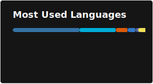

# Hi there

<picture>
  <source
    media="(prefers-color-scheme: dark)"
    srcset="https://raw.githubusercontent.com/unchain0/unchain0/output/github-contribution-grid-snake-dark.svg"
  />
  <source
    media="(prefers-color-scheme: light)"
    srcset="https://raw.githubusercontent.com/unchain0/unchain0/output/github-contribution-grid-snake.svg"
  />
  
</picture>

## Profile

[](https://skillicons.dev)

Other statistics below ⤵️

### Github




### Wakatime

<!--START_SECTION:waka-->


**I'm an Early 🐤** 

```text
🌞 Morning                700 commits         ████████░░░░░░░░░░░░░░░░░   32.65 % 
🌆 Daytime                705 commits         ████████░░░░░░░░░░░░░░░░░   32.88 % 
🌃 Evening                574 commits         ███████░░░░░░░░░░░░░░░░░░   26.77 % 
🌙 Night                  165 commits         ██░░░░░░░░░░░░░░░░░░░░░░░   07.70 % 
```
📅 **I'm Most Productive on Wednesday** 

```text
Monday                   278 commits         ███░░░░░░░░░░░░░░░░░░░░░░   12.97 % 
Tuesday                  311 commits         ████░░░░░░░░░░░░░░░░░░░░░   14.51 % 
Wednesday                429 commits         █████░░░░░░░░░░░░░░░░░░░░   20.01 % 
Thursday                 277 commits         ███░░░░░░░░░░░░░░░░░░░░░░   12.92 % 
Friday                   415 commits         █████░░░░░░░░░░░░░░░░░░░░   19.36 % 
Saturday                 266 commits         ███░░░░░░░░░░░░░░░░░░░░░░   12.41 % 
Sunday                   168 commits         ██░░░░░░░░░░░░░░░░░░░░░░░   07.84 % 
```


📊 **This Week I Spent My Time On** 

```text
🕑︎ Time Zone: America/Sao_Paulo

💬 Programming Languages: 
TypeScript               19 hrs 7 mins       ██████████████████████░░░   86.76 % 
JSON                     55 mins             █░░░░░░░░░░░░░░░░░░░░░░░░   04.17 % 
SQL                      35 mins             █░░░░░░░░░░░░░░░░░░░░░░░░   02.71 % 
Python                   24 mins             ░░░░░░░░░░░░░░░░░░░░░░░░░   01.82 % 
Other                    17 mins             ░░░░░░░░░░░░░░░░░░░░░░░░░   01.35 % 

🔥 Editors: 
OpenCode                 22 hrs 2 mins       █████████████████████████   100.00 % 

🐱‍💻 Projects: 
designacoes-departamentos21 hrs 31 mins      ████████████████████████░   97.70 % 
sap                      21 mins             ░░░░░░░░░░░░░░░░░░░░░░░░░   01.64 % 
tanstack-router          6 mins              ░░░░░░░░░░░░░░░░░░░░░░░░░   00.46 % 
drizzle-orm              1 min               ░░░░░░░░░░░░░░░░░░░░░░░░░   00.10 % 
pdfmake                  0 secs              ░░░░░░░░░░░░░░░░░░░░░░░░░   00.07 % 

💻 Operating System: 
Linux                    22 hrs 2 mins       █████████████████████████   100.00 % 
```

**I Mostly Code in Python** 

```text
Python                   17 repos            ███████████████░░░░░░░░░░   60.71 % 
TypeScript               4 repos             ████░░░░░░░░░░░░░░░░░░░░░   14.29 % 
Go                       2 repos             ██░░░░░░░░░░░░░░░░░░░░░░░   07.14 % 
PHP                      1 repo              █░░░░░░░░░░░░░░░░░░░░░░░░   03.57 % 
JavaScript               1 repo              █░░░░░░░░░░░░░░░░░░░░░░░░   03.57 % 
```


**Timeline**


 Last Updated on 31/03/2026 19:41:29 UTC
<!--END_SECTION:waka-->
