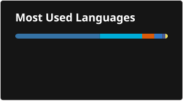

# Hi there

<picture>
  <source
    media="(prefers-color-scheme: dark)"
    srcset="https://raw.githubusercontent.com/unchain0/unchain0/output/github-contribution-grid-snake-dark.svg"
  />
  <source
    media="(prefers-color-scheme: light)"
    srcset="https://raw.githubusercontent.com/unchain0/unchain0/output/github-contribution-grid-snake.svg"
  />
  
</picture>

## Profile

[](https://skillicons.dev)

---

### Github




---

### Wakatime

<!--START_SECTION:waka-->


**I'm an Early 🐤** 

```text
🌞 Morning                1462 commits        ████████░░░░░░░░░░░░░░░░░   30.03 % 
🌆 Daytime                1672 commits        █████████░░░░░░░░░░░░░░░░   34.35 % 
🌃 Evening                1412 commits        ███████░░░░░░░░░░░░░░░░░░   29.01 % 
🌙 Night                  322 commits         ██░░░░░░░░░░░░░░░░░░░░░░░   06.61 % 
```
📅 **I'm Most Productive on Wednesday** 

```text
Monday                   755 commits         ████░░░░░░░░░░░░░░░░░░░░░   15.51 % 
Tuesday                  784 commits         ████░░░░░░░░░░░░░░░░░░░░░   16.11 % 
Wednesday                1083 commits        ██████░░░░░░░░░░░░░░░░░░░   22.25 % 
Thursday                 604 commits         ███░░░░░░░░░░░░░░░░░░░░░░   12.41 % 
Friday                   733 commits         ████░░░░░░░░░░░░░░░░░░░░░   15.06 % 
Saturday                 498 commits         ███░░░░░░░░░░░░░░░░░░░░░░   10.23 % 
Sunday                   411 commits         ██░░░░░░░░░░░░░░░░░░░░░░░   08.44 % 
```


📊 **This Week I Spent My Time On** 

```text
🕑︎ Time Zone: America/Sao_Paulo

💬 Programming Languages: 
No Activity Tracked This Week

🔥 Editors: 
Opencode Cli             1 min               █████████████████████████   100.00 % 

🐱‍💻 Projects: 
No Activity Tracked This Week

💻 Operating System: 
No Activity Tracked This Week
```

🤖 **AI Coding This Week** 

```text
No AI Coding Activity Tracked This Week
```

**I Mostly Code in Python** 

```text
Python                   15 repos            █████████████░░░░░░░░░░░░   53.57 % 
TypeScript               3 repos             ███░░░░░░░░░░░░░░░░░░░░░░   10.71 % 
PHP                      2 repos             ██░░░░░░░░░░░░░░░░░░░░░░░   07.14 % 
Go                       2 repos             ██░░░░░░░░░░░░░░░░░░░░░░░   07.14 % 
Java                     1 repo              █░░░░░░░░░░░░░░░░░░░░░░░░   03.57 % 
```


**Timeline**


 Last Updated on 27/08/2026 21:50:27 UTC
<!--END_SECTION:waka-->
