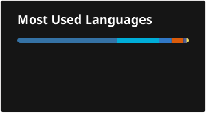

# Hi there

<picture>
  <source
    media="(prefers-color-scheme: dark)"
    srcset="https://raw.githubusercontent.com/unchain0/unchain0/output/github-contribution-grid-snake-dark.svg"
  />
  <source
    media="(prefers-color-scheme: light)"
    srcset="https://raw.githubusercontent.com/unchain0/unchain0/output/github-contribution-grid-snake.svg"
  />
  
</picture>

## Profile

[](https://skillicons.dev)

---

### Github




---

### Wakatime

<!--START_SECTION:waka-->


**I'm an Early 🐤** 

```text
🌞 Morning                3355 commits        ████████░░░░░░░░░░░░░░░░░   30.18 % 
🌆 Daytime                3635 commits        ████████░░░░░░░░░░░░░░░░░   32.69 % 
🌃 Evening                3082 commits        ███████░░░░░░░░░░░░░░░░░░   27.72 % 
🌙 Night                  1046 commits        ██░░░░░░░░░░░░░░░░░░░░░░░   09.41 % 
```
📅 **I'm Most Productive on Friday** 

```text
Monday                   1607 commits        ████░░░░░░░░░░░░░░░░░░░░░   14.45 % 
Tuesday                  1473 commits        ███░░░░░░░░░░░░░░░░░░░░░░   13.25 % 
Wednesday                1778 commits        ████░░░░░░░░░░░░░░░░░░░░░   15.99 % 
Thursday                 1320 commits        ███░░░░░░░░░░░░░░░░░░░░░░   11.87 % 
Friday                   2532 commits        ██████░░░░░░░░░░░░░░░░░░░   22.77 % 
Saturday                 1262 commits        ███░░░░░░░░░░░░░░░░░░░░░░   11.35 % 
Sunday                   1146 commits        ███░░░░░░░░░░░░░░░░░░░░░░   10.31 % 
```


📊 **This Week I Spent My Time On** 

```text
🕑︎ Time Zone: America/Sao_Paulo

💬 Programming Languages: 
Python                   2 hrs 45 mins       ██████░░░░░░░░░░░░░░░░░░░   25.17 % 
Rust                     2 hrs 27 mins       ██████░░░░░░░░░░░░░░░░░░░   22.49 % 
Markdown                 1 hr 28 mins        ███░░░░░░░░░░░░░░░░░░░░░░   13.45 % 
TOML                     1 hr                ██░░░░░░░░░░░░░░░░░░░░░░░   09.28 % 
Other                    1 hr                ██░░░░░░░░░░░░░░░░░░░░░░░   09.15 % 

🔥 Editors: 
Codex Vscode             9 hrs 14 mins       █████████████████████░░░░   84.47 % 
Neovim                   1 hr 41 mins        ████░░░░░░░░░░░░░░░░░░░░░   15.53 % 

🐱‍💻 Projects: 
flashcards-generator     4 hrs 15 mins       ██████████░░░░░░░░░░░░░░░   38.91 % 
avell                    2 hrs 25 mins       ██████░░░░░░░░░░░░░░░░░░░   22.13 % 
eclipse-news             2 hrs 21 mins       █████░░░░░░░░░░░░░░░░░░░░   21.55 % 
designa-eventos          36 mins             █░░░░░░░░░░░░░░░░░░░░░░░░   05.61 % 
Unknown Project          31 mins             █░░░░░░░░░░░░░░░░░░░░░░░░   04.85 % 

💻 Operating System: 
Linux                    10 hrs 56 mins      █████████████████████████   100.00 % 
```

🤖 **AI Coding This Week** 

```text
⏱ AI Coding Time: 10 hrs 56 mins (99.99%)

✍️ 4,495 lines written by AI, 16 lines written by hand (99.65% AI-written)

🔤 114,461,304 Input Tokens, 1,011,688 Output Tokens

💵 $1123.29 Estimated AI Cost This Week

🧠 42 AI Sessions, 61 AI Prompts

GPT                      4,379 lines         ██████████████████████░░░   89.31 % 
Codex-Vscode             524 lines           ███░░░░░░░░░░░░░░░░░░░░░░   10.69 % 

🔎 AI Coding Insights:
🤖 AI-Driven — 99.65% of written lines came from AI
📚 Verbose Prompter — average 2,370 characters per prompt
🎯 One-Shot Prompter — average 1 prompts per session
🚀 High AI Trust — 0.33% of changed lines were hand-edited
```

**I Mostly Code in Python** 

```text
Python                   12 repos            ███████████░░░░░░░░░░░░░░   42.86 % 
Rust                     4 repos             ████░░░░░░░░░░░░░░░░░░░░░   14.29 % 
TypeScript               3 repos             ███░░░░░░░░░░░░░░░░░░░░░░   10.71 % 
PHP                      2 repos             ██░░░░░░░░░░░░░░░░░░░░░░░   07.14 % 
Java                     1 repo              █░░░░░░░░░░░░░░░░░░░░░░░░   03.57 % 
```


**Timeline**


 Last Updated on 06/10/2026 00:19:23 UTC
<!--END_SECTION:waka-->
